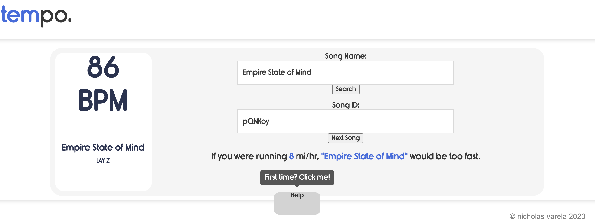

# tempo.
This project takes in a song and will tell you its tempo. Soon it will give you information on what pacing to run with the song. 
## Access the live project at https://nicholasvarela.github.io/tempo./

## TODO: 
Drop down with Song Selector 

Fix Tempo suggestion 

## Change Log: 

2/20/2020  Intital Upload of Working API

5/14/2020  Fixed API

8/10/2020  Upload with introduction button

8/15/2020  Fixed Merge Error

9/1/2020   Added notification for unsuccessful search

## Attributions 
I am extremely greatful to these guides and tutorials. 

Code Explained on Youtube 

Run2R for the tempo pacing

getsongbpm.com for the API with the song's bpm 

CORS-Anywhere Heroku Proxy. Custom Implementation. 
https://cors-anywhere.herokuapp.com/ 

